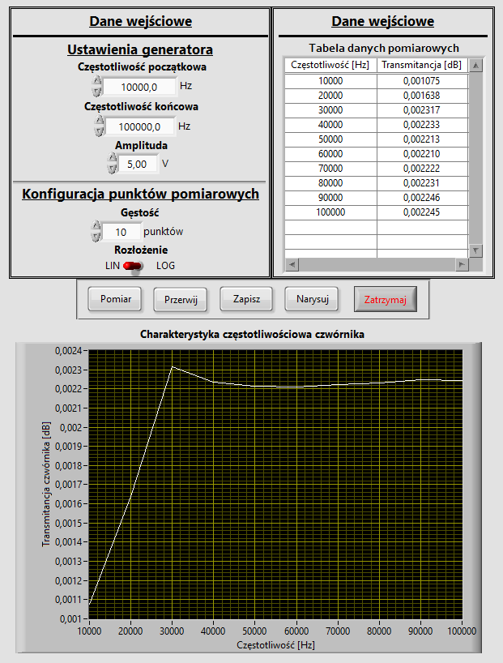

# LabVIEW Measuring Devices Project
## Introduction
Repository contains files and documentation (PL) of LabVIEW project based on connection to measuring devices (Wrocław University of Science and Technology/Faculty of Electronics/Electronics/4th Semester/Data Acquisition and Processing Systems).

## Setup
Run a project file ([Main.vi](./Project/Main.vi)) in LabView.

<b>To run this application correctly, you must have connection and proper settings to following measuring devices:</b>
<ul>
  <li>HP 33120A Programmable Function Generator,</li>
  <li>HP 34401A Programmable Digital Multimeter.</li>
</ul>

## Preview (PL)

  

## Documentation (PL)
https://wieczorek-daniel.github.io/labview-measuring-devices-project/
